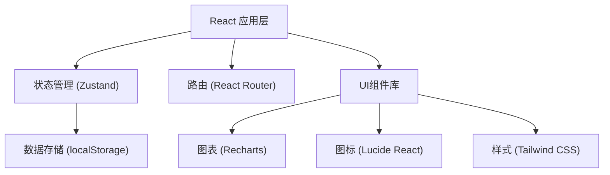
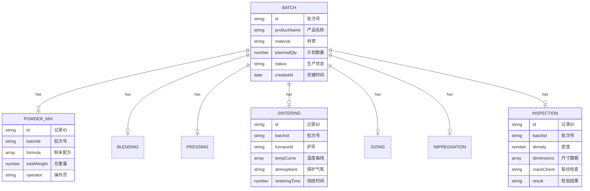

## 1. 架构设计

本系统为纯前端单页应用，采用 React + TypeScript 技术栈，使用 localStorage 进行数据持久化存储，无需后端服务即可独立运行。



## 2. 技术选型

- **前端框架**：React 18 + TypeScript
- **构建工具**：Vite 5
- **样式方案**：Tailwind CSS 3
- **路由管理**：React Router DOM 6
- **状态管理**：Zustand
- **图表库**：Recharts
- **图标库**：Lucide React
- **数据存储**：localStorage（前端持久化）
- **初始化模板**：react-ts

## 3. 路由定义

| 路由路径 | 页面名称 | 说明 |
|----------|----------|------|
| / | 首页仪表盘 | 生产数据概览、统计指标 |
| /mixing-powder | 粉末配料 | 金属粉末配比管理 |
| /blending | 混料制粒 | 润滑剂混料与制粒 |
| /pressing | 压制成型 | 压制压力与密度控制 |
| /sintering | 高温烧结 | 炉温曲线与气氛监控 |
| /sizing | 复压整形 | 复压整形量管理 |
| /impregnation | 浸油处理 | 含油轴承浸油 |
| /inspection | 尺寸检验 | 密度测量与公差检验 |
| /furnace-ledger | 炉次台账 | 烧结炉次完整记录 |

## 4. 数据模型

### 4.1 数据模型定义



### 4.2 状态管理

使用 Zustand 进行全局状态管理，按功能模块划分 store：
- useBatchStore：生产批次管理
- usePowderMixStore：粉末配料数据
- useSinteringStore：烧结数据与炉次台账
- useInspectionStore：检验数据

## 5. 项目结构

```
src/
├── components/          # 公共组件
│   ├── Layout/         # 布局组件
│   ├── DataTable/      # 数据表格
│   ├── StatCard/       # 统计卡片
│   └── FormField/      # 表单字段
├── pages/              # 页面组件
│   ├── Dashboard/      # 首页仪表盘
│   ├── PowderMix/      # 粉末配料
│   ├── Blending/       # 混料制粒
│   ├── Pressing/       # 压制成型
│   ├── Sintering/      # 高温烧结
│   ├── Sizing/         # 复压整形
│   ├── Impregnation/   # 浸油处理
│   ├── Inspection/     # 尺寸检验
│   └── FurnaceLedger/  # 炉次台账
├── store/              # Zustand 状态管理
├── utils/              # 工具函数
├── types/              # TypeScript 类型定义
├── data/               # Mock 数据
├── App.tsx             # 应用入口
├── main.tsx            # 主入口
└── index.css           # 全局样式
```

## 6. 关键技术点

1. **数据持久化**：使用 localStorage 存储所有生产数据，页面刷新不丢失
2. **批次追溯**：以批次号为主线串联所有工序数据，实现全流程追溯
3. **图表可视化**：烧结炉温曲线使用 Recharts 实现交互式图表
4. **表单验证**：关键工艺参数设置校验规则，确保数据准确性
5. **响应式布局**：侧边栏可折叠，适配不同分辨率屏幕
6. **工业风格UI**：采用工业蓝主色调，稳重专业的视觉风格
